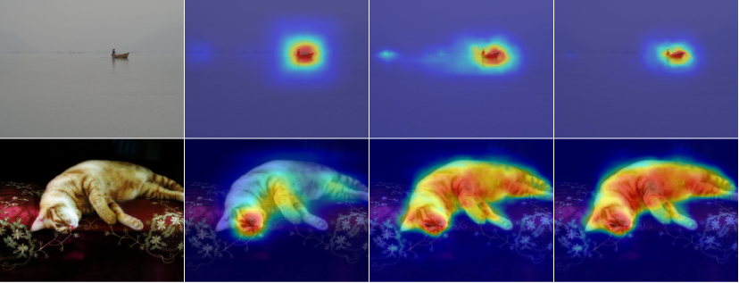

# Learning Structure-Aware Semantic Segmentation with Image-Level Supervision
<!-- <p align="center"></p> -->

The implementation of **Learning Structure-Aware Semantic Segmentation with Image-Level Supervision**, Jiawei Liu, Jing Zhang, Yicong Hong and Nick Barnes, IJCNN 2021 [[Paper]](https://arxiv.org/abs/2104.07216).

## Abstract
Compared with expensive pixel-wise annotations, image-level labels make it possible to learn semantic segmentation in a weakly-supervised manner. Within this pipeline, the class activation map (CAM) is obtained and further processed to serve as a pseudo label to train the semantic segmentation model in a fully-supervised manner. In this paper, we argue that the lost structure information in CAM limits its application in downstream semantic segmentation, leading to deteriorated predictions. Furthermore, the inconsistent class activation scores inside the same object contradicts the common sense that each region of the same object should belong to the same semantic category. To produce sharp prediction with structure information, we introduce an auxiliary semantic boundary detection module, which penalizes the deteriorated predictions. Furthermore, we adopt smoothness loss to encourage prediction inside the object to be consistent. Experimental results on the PASCAL-VOC dataset illustrate the effectiveness of the proposed solution.

Thanks to the work of [Yude Wang](https://github.com/YudeWang) and [jiwoon-ahn](https://github.com/jiwoon-ahn), the code of this repository borrow heavly from their [SEAM](https://github.com/YudeWang/SEAM) and [AffinityNet](https://github.com/jiwoon-ahn/psa) repositories, and we follw the same pipeline to verify the effectiveness of our solution.

## Citation
If you find the code useful, please consider citing our paper using the following BibTeX entry.
```
@article{liu2021learning,
  title={Learning structure-aware semantic segmentation with image-level supervision},
  author={Liu, Jiawei and Zhang, Jing and Hong, Yicong and Barnes, Nick},
  journal={arXiv preprint arXiv:2104.07216},
  year={2021}
}
```

## Requirements
- Python 3.6
- pytorch 0.4.1, torchvision 0.2.1
- CUDA 9.0
- 4 x GPUs (12GB)

## Usage
### Installation
- Install python dependencies.
```
pip install -r requirements.txt
```
- Download PASCAL VOC 2012 devkit (follow instructions in http://host.robots.ox.ac.uk/pascal/VOC/voc2012/#devkit). It is suggested to make a soft link toward downloaded dataset.
```
ln -s $your_dataset_path/VOCdevkit/VOC2012 VOC2012
```


### Smoothing Branch (SB) step

1. SB training
```
python train_SB.py --voc12_root VOC2012 --weights $pretrained_model --session_name $your_session_name
```

2. SB inference. 
```
python infer_SB.py --weights $SB_weights --infer_list [voc12/val.txt | voc12/train.txt | voc12/train_aug.txt] --out_cam $your_cam_dir --out_crf $your_crf_dir
```

3. SB step evaluation. We provide python mIoU evaluation script `evaluation.py`, or you can use official development kit. Here we suggest to show the curve of mIoU with different background score.
```
python evaluation.py --list VOC2012/ImageSets/Segmentation/[val.txt | train.txt] --predict_dir $your_cam_dir --gt_dir VOC2012/SegmentationClass --comment $your_comments --type npy --curve True
```

### Random walk step
The random walk step keep the same with AffinityNet repository.
1. Train AffinityNet.
```
python train_aff.py --weights $pretrained_model --voc12_root VOC2012 --la_crf_dir $your_crf_dir_4.0 --ha_crf_dir $your_crf_dir_24.0 --session_name $your_session_name
```
2. Random walk propagation
```
python infer_aff.py --weights $aff_weights --infer_list [voc12/val.txt | voc12/train.txt] --cam_dir $your_cam_dir --voc12_root VOC2012 --out_rw $your_rw_dir
```
3. Random walk step evaluation
```
python evaluation.py --list VOC2012/ImageSets/Segmentation/[val.txt | train.txt] --predict_dir $your_rw_dir --gt_dir VOC2012/SegmentationClass --comment $your_comments --type png
```
